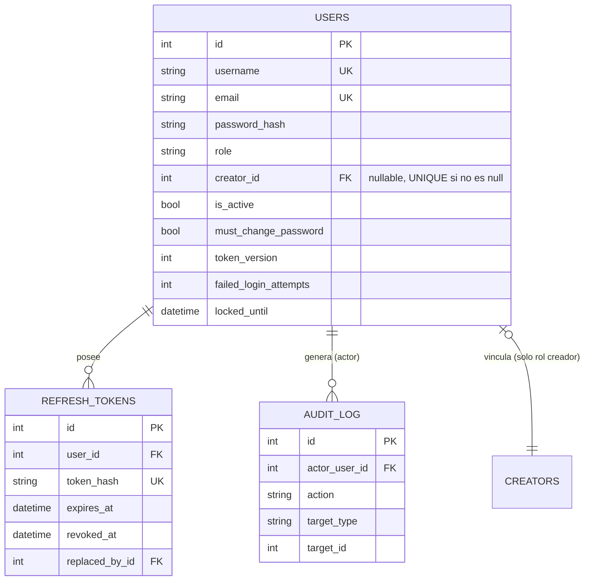

# Arquitectura del sistema de autenticación, usuarios, roles y permisos

> Diseño final implementado (Fases 2-3 completas: código en `dami-branch`, 90 pruebas pytest + 5 E2E Playwright en verde). Complementa — y en algunos puntos corrige — el diseño preliminar de `doc/auth-diseno-fase1.md`.

---

## 1. Resumen

Se agregó autenticación por cookies httpOnly (JWT de acceso + refresh opaco con rotación), tres roles (`superadmin`, `admin`, `creador`) y una matriz de permisos aplicada en cada endpoint. El riesgo **RISKS.md #2** ("sin autenticación en la API") queda mitigado.

## 2. Esquema de base de datos

Tres tablas nuevas, aditivas (no tocan `creators`/`brands`/`tickets`):

- `role` es un `String` validado por el enum Python `UserRole` (`app/models.py`), **sin** `CHECK` a nivel DB — agregar un rol nuevo no requiere migración, solo actualizar el enum y la matriz de permisos.
- `creator_id` tiene un índice único parcial (`WHERE creator_id IS NOT NULL`): un `Creator` tiene a lo sumo un usuario vinculado.
- Todas las fechas usadas en comparaciones (`RefreshToken.expires_at`, `User.locked_until`) se guardan y comparan como **UTC naive** (sin tzinfo) — SQLite no preserva tzinfo al leer de vuelta, así que mezclar aware/naive revienta con `TypeError`. Ver `app/security.py` (`refresh_token_expiry`) y `app/crud.py` (`is_locked`, `register_failed_login`).

## 3. Matriz de permisos

Sin cambios respecto al diseño de Fase 1 (`doc/auth-diseno-fase1.md` §2), verificada por la suite de pruebas (`backend/tests/test_permissions.py`, `test_users_management.py`). Resumen de las reglas que más importan:

| Regla | Detalle |
|---|---|
| Un `creador` solo ve su propio `Creator`/tickets | Filtrado server-side en `routers/creators.py` y `routers/tickets.py`, ignora intentos de filtrar por otro nombre |
| `GET /api/tickets/file/{id}` | 403 si el ticket no es del creador autenticado — corrige el IDOR original (antes, cualquiera con el ID podía descargar cualquier comprobante) |
| `POST /api/tickets/` | 403 si un creador intenta crear el ticket a nombre de otro `creator_id` |
| `admin` | Gestiona solo usuarios `role=creador`, **más su propia fila** (puede autodesactivarse, no editarse — eso es `/api/auth/me`) |
| `superadmin` | Único, inmutable por API: `POST /api/users/` nunca acepta `role=superadmin`; ningún endpoint permite cambiar su `role`/`is_active` |
| `/uploads` (mount estático) | Eliminado; todo archivo se sirve por `GET /api/tickets/file/{id}` (autenticado) |
| `/docs`, `/redoc` | Deshabilitados si `ENV=production` |

## 4. Estrategia de tokens

- **Access token**: JWT (HS256), cookie `access_token`, `Path=/`, `httpOnly`, `SameSite=Lax`, `Secure` solo si `ENV=production`. Vida: `JWT_ACCESS_TOKEN_EXPIRE_MINUTES` (15 por defecto). Claims: `sub`, `role`, `tv` (token_version), `exp`.
- **Refresh token**: opaco (`secrets.token_urlsafe(32)`), cookie `refresh_token`, `Path=/api/auth`, mismos flags. Vida: `JWT_REFRESH_TOKEN_EXPIRE_DAYS` (7). Se guarda **hasheado** (SHA-256) en `refresh_tokens`, nunca en claro.
- **Por qué cookies y no `localStorage`**: un XSS no puede leer una cookie `httpOnly` directamente. El CSRF clásico queda mitigado por `SameSite=Lax` (no se envía en POST/PUT cross-site) + CORS restrictivo (`allow_origins` explícito), sin necesidad de un token CSRF adicional.
- **Revocación de access token**: en cada request, `get_current_user` compara el `tv` del JWT contra `User.token_version` en DB — un cambio de contraseña o una desactivación invalida el access token vigente en la siguiente request, sin esperar a que expire.
- **Rotación de refresh token**: cada `/api/auth/refresh` emite uno nuevo y marca el usado como `revoked_at` + `replaced_by_id`. Si un token ya revocado se vuelve a presentar (señal de robo/reuso), se revoca **toda la cadena** de refresh tokens del usuario, forzando login de nuevo. Verificado en `test_refresh_reuse_detected_revokes_chain`.
- **Rate limiting de login**: doble capa — (1) bloqueo incremental por cuenta (`User.failed_login_attempts`/`locked_until`, 5 intentos → bloqueo creciente hasta 60 min) y (2) límite de 30 intentos/15 min por IP en memoria (`app/security.py`, se reinicia si el proceso se reinicia — aceptable en un backend de proceso único sin `--workers`).

## 5. Decisiones y desviaciones respecto al diseño de Fase 1

Estas surgieron durante la implementación/verificación y **no** estaban en `auth-diseno-fase1.md`:

1. **`GET /api/users/` para un `admin` incluye su propia fila**, aunque su rol no sea `creador`. Necesario para que la regla "un admin puede autodesactivarse con confirmación" (ya prevista en el diseño §0.3) sea alcanzable desde la UI — si no, un admin nunca vería su propia fila en la tabla que gestiona. Ver `routers/users.py::list_users`.
2. **Dominios de correo para cuentas auto-generadas**: `email-validator` (usado por Pydantic `EmailStr`) rechaza TLDs de uso especial (`.local`, `.test`, `.example`, `.invalid`) por RFC 6761/2606. `seed_auth.py` genera `{usuario}@creadores.grupo-ortiz.com` en vez de `.local` — encontrado y corregido durante la verificación manual (causaba `500` en `GET /api/users/`).
3. **`/uploads` no solo se dejó de montar** — la entrada correspondiente en `frontend/vite.config.js` (proxy) también se eliminó, y el proxy de `/api` ahora lee el puerto de un env var opcional (`VITE_BACKEND_PORT`, default `8000`) para poder apuntar la suite E2E a un backend de pruebas sin editar el archivo committeado.

## 6. Limitaciones conocidas (fuera de alcance de esta fase)

- Un `GET /api/tickets/file/{id}` abierto en pestaña nueva (`target="_blank"`) no pasa por el interceptor de refresh de `api/index.js` — si el access token expiró justo en ese instante, el navegador muestra el JSON de error crudo en vez de refrescar la sesión. Con un access token de 15 min esto es infrecuente; se podría resolver a futuro sirviendo el archivo vía `fetch` + blob, a costa de perder la vista previa nativa del navegador para PDFs/imágenes.
- El límite de intentos de login por IP vive en memoria (no persiste ni se comparte entre procesos). Si el despliegue pasa a múltiples workers/instancias, habría que moverlo a algo compartido (Redis u otro almacén).
- El reset de contraseña por un admin/superadmin devuelve la contraseña temporal una sola vez en la respuesta HTTP — no hay integración de correo; quien resetea es responsable de comunicarla por un canal seguro.
- OWASP Top 10 — cobertura y lo que queda fuera:
  - **A01 Broken Access Control**: cubierto (matriz de permisos + pruebas de IDOR).
  - **A02 Cryptographic Failures**: contraseñas con argon2id; secretos por variable de entorno.
  - **A03 Injection**: SQLAlchemy ORM parametrizado en todo el código; sin SQL crudo.
  - **A04/A05 Diseño inseguro / Config de seguridad**: cookies `httpOnly`/`SameSite`, CORS restrictivo, `/docs` deshabilitado en producción.
  - **A07 Identification and Authentication Failures**: cubierto (bloqueo incremental, rotación de refresh, política de contraseñas).
  - **Fuera de alcance**: cabeceras de seguridad HTTP adicionales (CSP, HSTS, X-Frame-Options) — no se agregaron; recomendable antes de exponer fuera de `127.0.0.1`. Tampoco hay 2FA/MFA.

## 7. Cobertura de pruebas

- **Backend (pytest)**: `backend/tests/` — 90 pruebas. `test_auth.py` (login, bloqueo, rate limit, cambio de contraseña, refresh/rotación/reuso, logout), `test_permissions.py` (401 sin token en 26 endpoints, matriz por rol, IDOR de tickets), `test_users_management.py` (alcance de admin, inmutabilidad de superadmin, auto-desactivación). Ejecutar: `cd backend && python -m pytest`.
- **E2E (Playwright)**: `frontend/e2e/auth.spec.js` — flujo completo superadmin → crea admin → admin crea creador → creador ve solo lo suyo → cambio de contraseña obligatorio → logout → usuario desactivado no puede entrar. Requiere un backend + frontend dedicados a pruebas (ver `doc/auth-manual-usuario.md` §Pruebas E2E) porque el proxy de Vite necesita apuntar a un backend con una DB de pruebas, no a la de desarrollo.
