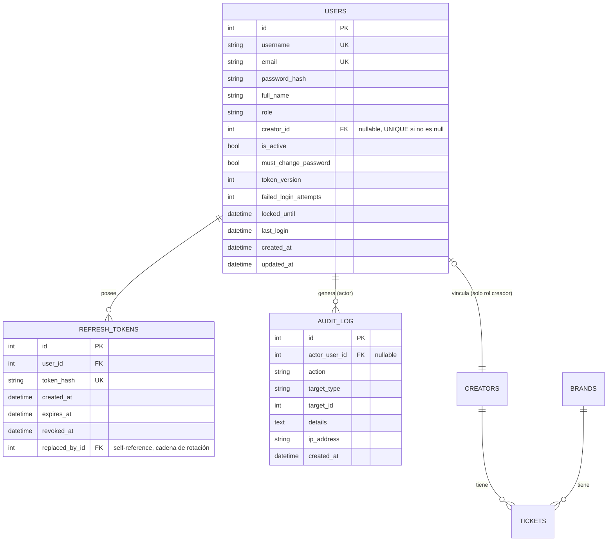
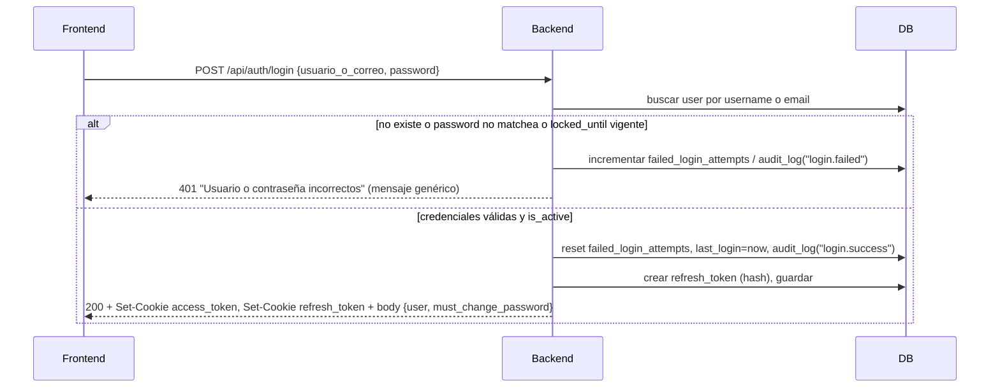
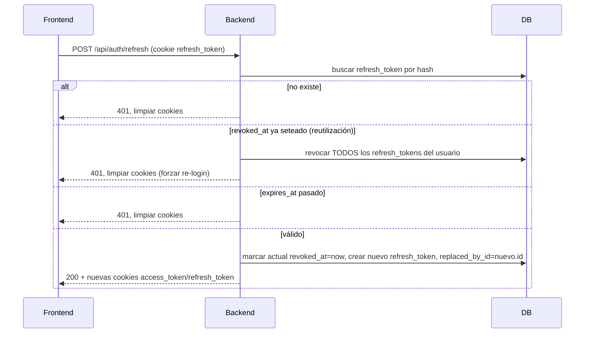
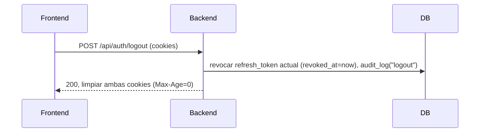

# Fase 1 — Diseño del sistema de autenticación, usuarios, roles y permisos

> Entregable de la Fase 1 según `doc/prompt-sistema-autenticacion.md`. Este documento se detiene antes de escribir código — requiere aprobación explícita antes de iniciar la Fase 2 (implementación).

---

## 0. Supuestos (a confirmar antes de implementar)

Estos puntos eran ambiguos en los requerimientos originales. Diseñé una decisión concreta para cada uno; corrígeme si alguno no es lo que querías:

1. **Login con usuario o correo**: un solo campo "usuario o correo" acepta cualquiera de los dos; el backend intenta match contra `username` primero y luego `email`.
2. **Superadmin es un singleton inmutable por API**: `POST /api/users/` nunca acepta `role=superadmin` (ni siquiera si lo pide el propio superadmin) — la única cuenta superadmin es la que crea el script de seed directamente en la base de datos. El `role` e `is_active` del superadmin **no se pueden modificar por ningún endpoint**, bajo ninguna confirmación. Si algún día hace falta recuperarlo (contraseña perdida, cuenta corrupta), se documenta en Fase 4 un script de servidor para eso — no una ruta de API.
3. **Autodesactivación de un admin**: sí está permitida (puede haber varios admins), pero requiere que el body incluya `confirm_username` igual al propio username, como protección contra accidente (esto es lo que interpreto como la "confirmación tipada" del requerimiento, aplicada donde tiene sentido: un admin desactivándose a sí mismo).
4. **Dashboard global fuera de alcance para `creador`**: su resumen personal en `/perfil` reutiliza `GET /api/creators/{id}` (ya con scope a su propio id), no se crea un endpoint de dashboard reducido.
5. **`brand-spend` (breakdown por marca) es vista administrativa global** — no se expone a `creador` (no fue pedido explícitamente; lo dejo fuera de alcance).
6. **Rate limiting con implementación propia en memoria** (diccionario en el proceso), sin dependencia nueva tipo `slowapi`/Redis. Limitación documentada: el contador se reinicia si el proceso se reinicia, y no es distribuido — aceptable porque hoy corre como un único proceso uvicorn local (`--reload` sin `--workers`). Si el proyecto escala a múltiples workers/instancias, esto habría que revisarlo.
7. **Reset de contraseña por admin**: no hay sistema de correo. La contraseña temporal se devuelve una sola vez en la respuesta del endpoint (visible solo para quien lo ejecuta, autenticado) para que la comunique fuera de banda. Es una limitación conocida para un equipo interno pequeño.
8. **Un `Creator` sin usuario asociado sigue siendo válido** (dato histórico) — no se fuerza a tener usuario vinculado.

---

## 1. Esquema de base de datos

### 1.1 Diagrama

### 1.2 Tablas nuevas (SQLAlchemy)

**`users`**
- `id` INTEGER PK
- `username` VARCHAR(50) UNIQUE NOT NULL
- `email` VARCHAR(255) UNIQUE NOT NULL
- `password_hash` VARCHAR(255) NOT NULL (argon2id)
- `full_name` VARCHAR(150) NOT NULL
- `role` VARCHAR(20) NOT NULL — validado por un `enum.Enum` de Python (`superadmin`, `admin`, `creador`), **sin** `CHECK` a nivel DB
- `creator_id` INTEGER NULL, FK → `creators.id`, con **índice único parcial** (`WHERE creator_id IS NOT NULL`) para que un `Creator` tenga a lo sumo un usuario
- `is_active` BOOLEAN NOT NULL DEFAULT TRUE
- `must_change_password` BOOLEAN NOT NULL DEFAULT FALSE
- `token_version` INTEGER NOT NULL DEFAULT 0 — se incrementa en cambio de contraseña/"cerrar todas las sesiones"; el access token lleva este valor como claim y se compara contra el de la DB en cada request
- `failed_login_attempts` INTEGER NOT NULL DEFAULT 0, `locked_until` DATETIME NULL — bloqueo incremental
- `last_login`, `created_at`, `updated_at` DATETIME

**`refresh_tokens`**
- `id` PK, `user_id` FK → `users.id` ON DELETE CASCADE
- `token_hash` VARCHAR(255) UNIQUE NOT NULL — se guarda **hash SHA-256** del token opaco, nunca el valor crudo
- `created_at`, `expires_at` DATETIME
- `revoked_at` DATETIME NULL
- `replaced_by_id` INTEGER NULL, FK → `refresh_tokens.id` — arma la cadena de rotación; si un token con `revoked_at` no nulo se vuelve a presentar (reutilización = robo), se revoca **toda la cadena** del usuario y se fuerza a re-login.

**`audit_log`**
- `id` PK, `actor_user_id` FK NULL (quién hizo la acción; NULL en login fallido de usuario inexistente)
- `action` VARCHAR(50) (`login.success`, `login.failed`, `logout`, `password.changed_self`, `password.reset_by_admin`, `user.create`, `user.update`, `user.activate`, `user.deactivate`)
- `target_type`, `target_id` — a qué entidad afectó
- `details` TEXT (JSON serializado, opcional)
- `ip_address` VARCHAR(45), `created_at` DATETIME

### 1.3 Por qué NO una tabla `roles`/`permissions` normalizada

Con solo 3 roles y una matriz de permisos que se evalúa por código (`require_role(...)` por endpoint), una tabla dinámica de roles/permisos sería sobre-ingeniería para este proyecto (que ya prioriza pocas dependencias y simplicidad). Si en el futuro se necesitan roles configurables en runtime, ese sería el siguiente paso — hoy el enum de Python + la matriz de este documento son la fuente de verdad, y agregar un rol nuevo es: añadir al enum, añadir su fila a la matriz, añadir sus `Depends` correspondientes. Sin migración de esquema.

---

## 2. Matriz de permisos — endpoint × rol

`Anon` = sin token válido. `CR` = creador. `AD` = admin. `SA` = superadmin.

| Método | Endpoint | Anon | CR | AD | SA | Notas |
|---|---|---|---|---|---|---|
| GET | `/api/health` | ✅ | ✅ | ✅ | ✅ | Público, sin PII |
| GET | `/docs`, `/redoc` | ⚠️ | ⚠️ | ⚠️ | ⚠️ | Habilitado solo si `ENV != production` (ver §5); no gana granularidad de rol |
| POST | `/api/auth/login` | ✅ | — | — | — | Público |
| POST | `/api/auth/refresh` | ✅* | — | — | — | *Requiere cookie de refresh válida, no requiere access token |
| POST | `/api/auth/logout` | ❌ | ✅ | ✅ | ✅ | Revoca el refresh token actual |
| GET | `/api/auth/me` | ❌ | ✅ | ✅ | ✅ | Datos propios |
| PUT | `/api/auth/me` | ❌ | ✅ | ✅ | ✅ | Editar nombre/correo propios |
| POST | `/api/auth/change-password` | ❌ | ✅ | ✅ | ✅ | Requiere contraseña actual |
| GET | `/api/creators/` | ❌ | ✅ (filtrado a sí mismo) | ✅ | ✅ | CR recibe lista con solo su propio `Creator` |
| GET | `/api/creators/kpi` | ❌ | ❌ | ✅ | ✅ | Agregado global |
| GET | `/api/creators/{id}` | ❌ | ✅ solo si `id == self.creator_id`, si no 403 | ✅ | ✅ | Corrige IDOR potencial |
| POST | `/api/creators/` | ❌ | ❌ | ✅ | ✅ | |
| PUT | `/api/creators/{id}` | ❌ | ❌ | ✅ | ✅ | CR no edita ni su propio presupuesto |
| GET | `/api/brands/` | ❌ | ✅ (solo lectura) | ✅ | ✅ | CR necesita ver marcas para subir tickets |
| GET | `/api/brands/{id}` | ❌ | ✅ | ✅ | ✅ | |
| POST | `/api/brands/` | ❌ | ❌ | ✅ | ✅ | |
| PUT | `/api/brands/{id}` | ❌ | ❌ | ✅ | ✅ | |
| GET | `/api/tickets/` | ❌ | ✅ forzado a `creator_id = self` (ignora filtros de otros creadores) | ✅ | ✅ | |
| GET | `/api/tickets/brand-spend` | ❌ | ❌ | ✅ | ✅ | Fuera de alcance para CR (supuesto §0.5) |
| GET | `/api/tickets/file/{id}` | ❌ | ✅ solo si `ticket.creator_id == self.creator_id`, si no 403 | ✅ | ✅ | **Corrige el IDOR crítico actual** |
| POST | `/api/tickets/` | ❌ | ✅ solo si `body.creator_id == self.creator_id`, si no 403 | ✅ | ✅ | |
| GET | `/api/dashboard/summary` | ❌ | ❌ | ✅ | ✅ | |
| GET | `/api/dashboard/monthly-spend` | ❌ | ❌ | ✅ | ✅ | |
| GET | `/api/dashboard/creator-usage` | ❌ | ❌ | ✅ | ✅ | |
| GET | `/api/users/` | ❌ | ❌ | ✅ (solo `role=creador`) | ✅ (todos) | AD ve únicamente usuarios de rol `creador` |
| POST | `/api/users/` | ❌ | ❌ | ✅ solo `role=creador` | ✅ (`creador`/`admin`; nunca `superadmin`, ver §0.2) | |
| GET | `/api/users/{id}` | ❌ | ❌ | ✅ solo si target es `role=creador` | ✅ | |
| PUT | `/api/users/{id}` | ❌ | ❌ | ✅ solo si target es `role=creador` | ✅ (no puede tocar `role`/`is_active` del superadmin) | |
| POST | `/api/users/{id}/reset-password` | ❌ | ❌ | ✅ solo target `creador` | ✅ | Devuelve contraseña temporal una vez (§0.7) |
| PATCH | `/api/users/{id}/estado` (activar/desactivar) | ❌ | ❌ | ✅ solo target `creador`; auto-desactivación con `confirm_username` (§0.3) | ✅ (nunca sobre superadmin) | |
| `/uploads/*` (static mount) | — | — | — | — | **Se elimina el mount** — todo archivo se sirve vía `/api/tickets/file/{id}` autenticado |

---

## 3. Estrategia de tokens

### 3.1 Decisión: cookies httpOnly, no `localStorage`

| Opción | Riesgo principal | Por qué se descarta/elige |
|---|---|---|
| `localStorage` + header `Authorization` | XSS roba el token directamente vía JS, sin límite de tiempo de exposición | Descartado explícitamente por el requerimiento y por manejar comprobantes/montos (datos delicados) |
| Cookie httpOnly + SameSite | CSRF (mitigado, ver abajo) | **Elegida** — el token nunca es legible por JS, así que un XSS no puede exfiltrarlo directamente |

- **Access token**: JWT (HS256, `pyjwt`), cookie `access_token`, `Path=/`, `httpOnly`, `SameSite=Lax`, `Secure` solo si `ENV=production`. Vida: 15 min. Claims: `sub` (user id), `role`, `tv` (token_version), `iat`, `exp`.
- **Refresh token**: opaco (`secrets.token_urlsafe(32)`), cookie `refresh_token`, `Path=/api/auth`, `httpOnly`, `SameSite=Lax`, `Secure` en producción. Vida: 7 días. Se guarda **hasheado** (SHA-256) en `refresh_tokens`, nunca el valor crudo.

### 3.2 Por qué `SameSite=Lax` es suficiente sin CSRF token adicional

- Con `SameSite=Lax`, la cookie **no se envía** en requests cross-site que no sean navegación GET de nivel superior — específicamente, un `POST`/`PUT` disparado por `fetch`/`form` desde un sitio malicioso externo no incluye la cookie. Esto neutraliza el CSRF clásico contra los endpoints de mutación (que son todos POST/PUT/PATCH).
- Además, CORS ya es restrictivo (`allow_origins` = lista explícita desde `CORS_ORIGINS`, `allow_credentials=True` solo para esos orígenes) — un origen no listado ni siquiera puede leer la respuesta aunque lograra disparar el request.
- Con esto, se evita agregar un mecanismo de doble-submit-token, consistente con la filosofía de pocas dependencias del proyecto.
- **Revalidar en Fase 4** si en producción el frontend y backend terminan en dominios distintos (no localhost) — ahí `SameSite=Lax` seguiría funcionando siempre que sea el mismo *site* registrable, pero si se separan a dominios totalmente distintos habría que reconsiderar `SameSite=None; Secure` + CSRF token explícito.

### 3.3 Revocación

- **Access token**: en cada request, `get_current_user` decodea el JWT (barato, sin ir a DB) y **además** consulta al usuario en DB (ya se hace una consulta por request en este proyecto de todas formas) para verificar `is_active` y que `token_version` del claim coincide con el de la fila — así una desactivación o cambio de contraseña invalida el access token vigente en ≤ 1 request, sin esperar a que expire.
- **Refresh token**: revocación real vía `refresh_tokens.revoked_at`. En logout se revoca el token actual. En cada `/refresh`, se rota: se emite uno nuevo, se marca el usado como revocado con `replaced_by_id` apuntando al nuevo. Si se presenta un token ya revocado (reutilización → indicio de robo), se revocan **todos** los refresh tokens del usuario y se le exige login de nuevo.

### 3.4 Diagramas de secuencia

**Login**

**Refresh (con rotación y detección de reuso)**

**Logout**

---

## 4. Mapa de rutas frontend

| Ruta | Acceso | Cambios |
|---|---|---|
| `/login` | Pública (si ya hay sesión → redirect a `/`) | Nueva página, sin sidebar |
| `/` | Cualquier rol autenticado | Sin cambio de contenido |
| `/perfil` | Cualquier rol autenticado | Nueva página |
| `/dashboard` | SA, AD | CR → página 403 |
| `/creadores` | SA, AD | CR → 403 |
| `/transacciones` | Todos | CR ve datos ya filtrados por el backend (mismo componente) |
| `/administracion` | SA, AD | CR → 403 |
| `/administracion/usuarios` | SA, AD (AD ve solo usuarios `creador`) | Nueva sección |
| `*` | — | Si autenticado → `/`; si no → `/login` (preservando la ruta destino vía `state`) |

**`ProtectedRoute`**: componente que envuelve rutas, verifica sesión vía contexto (`AuthContext`), redirige a `/login` con `state={{from: location}}` si no hay sesión, y a una página `Forbidden` (403) si el rol no está en la whitelist de la ruta.

**Sidebar**: `NAV_ITEMS` se filtra por `role` del usuario en contexto; se agrega ítem "Mi Perfil" (todos), indicador de usuario logueado (nombre + rol) y botón "Cerrar sesión" (funcional también en modo colapsado, con `title`/tooltip).

---

## 5. Plan de migración y orden de commits

No hace falta una migración de esquema tradicional: `Base.metadata.create_all(bind=engine)` (ya se ejecuta al importar `main.py`) crea las tablas nuevas de forma aditiva sin tocar `creators`/`brands`/`tickets`. Lo que sí hace falta es un script de seed idempotente.

`backend/seed_auth.py` (idempotente):
1. Si no existe ningún usuario con `role=superadmin`, crea uno con username/email/contraseña temporal desde variables de entorno o argumentos CLI, `must_change_password=True`.
2. Flag `--vincular-creadores`: para cada `Creator` sin usuario, crea un `User(role=creador)` vinculado, con contraseña temporal y `must_change_password=True`. No se ejecuta por defecto.
3. No rompe `seed.py`/`seed_demo_year.py` — ambos crean `Creator`/`Brand`/`Ticket` directamente vía sesión SQLAlchemy, no pasan por HTTP, así que no se ven afectados por la protección de endpoints.

Commits propuestos (uno por bloque funcional, mensajes en español, todos en `dami-branch`):

1. `feat(auth): modelos de usuario, refresh tokens y auditoría + seed superadmin`
   — `models.py` (User, RefreshToken, AuditLog, enum UserRole), `seed_auth.py`, `.env.example` (nuevas vars).
2. `feat(auth): endpoints de login/refresh/logout/me + rate limiting`
   — `security.py` (hashing argon2, JWT), `schemas.py` (Token, LoginRequest, UserResponse...), `crud.py` (usuarios/refresh tokens), `routers/auth.py`, rate limiter en memoria, `requirements.txt`.
3. `feat(auth): proteger endpoints existentes + filtrado por rol + gestión de usuarios`
   — `dependencies.py` (`get_current_user`, `require_role`, scoping de creador), modificar `creators.py`/`brands.py`/`tickets.py`/`dashboard.py`, nuevo `routers/users.py`, eliminar mount `/uploads`, gatear `/docs`/`/redoc` por `ENV`.
4. `feat(auth): contexto de sesión, guards y login en frontend`
   — `AuthContext.jsx`, `ProtectedRoute.jsx`, `LoginPage.jsx`, `ForbiddenPage.jsx`, `api/index.js` (`credentials: "include"`, interceptor 401→refresh→retry o logout).
5. `feat(auth): perfil, gestión de usuarios en Administración y Sidebar por rol`
   — `ProfilePage.jsx`, gestión de usuarios (reutilizando patrones de `AdminView.jsx`), `Sidebar.jsx` filtrado por rol + logout.
6. `chore(auth): actualizar seeds y utilidades`
   — Verificación/ajuste de `seed.py`/`seed_demo_year.py` si hiciera falta, documentación de uso de `seed_auth.py`.

Fases 3 (pruebas) y 4 (documentación) siguen el plan ya descrito en `doc/prompt-sistema-autenticacion.md` sin cambios.

---

## 6. Dependencias nuevas

**Backend** (`requirements.txt`):
| Paquete | Para qué | Por qué esta y no otra |
|---|---|---|
| `pyjwt>=2.9.0` | Encode/decode del access token JWT | Más liviano que `python-jose` (no arrastra `cryptography` para HS256 simétrico); no necesitamos JWKS/asimetría con un solo backend |
| `argon2-cffi>=23.1.0` | Hashing de contraseñas (Argon2id, recomendado por OWASP) | Se usa directo (`argon2.PasswordHasher`) sin `passlib` — `passlib` está en mantenimiento mínimo y agrega una capa de abstracción innecesaria para un solo algoritmo |
| `email-validator>=2.2.0` | Validación de formato de `email` en Pydantic (`EmailStr`) | Es la dependencia que Pydantic v2 requiere para `EmailStr`; alternativa sería regex a mano, pero esto es lo estándar y ya lo trae el ecosistema Pydantic |

Rate limiting: **sin dependencia nueva** — contador en memoria por IP+usuario (supuesto §0.6).

**Frontend**: **ninguna dependencia nueva**. Cookies las maneja el navegador; solo se agrega `credentials: "include"` en los `fetch()` de `api/index.js`.

---

## 7. Próximo paso

Este documento cubre los 6 puntos pedidos para la Fase 1. Según el propio `prompt-sistema-autenticacion.md`: **me detengo aquí** y espero tu aprobación (o correcciones a la sección 0 de supuestos) antes de tocar una sola línea de código de la Fase 2.
