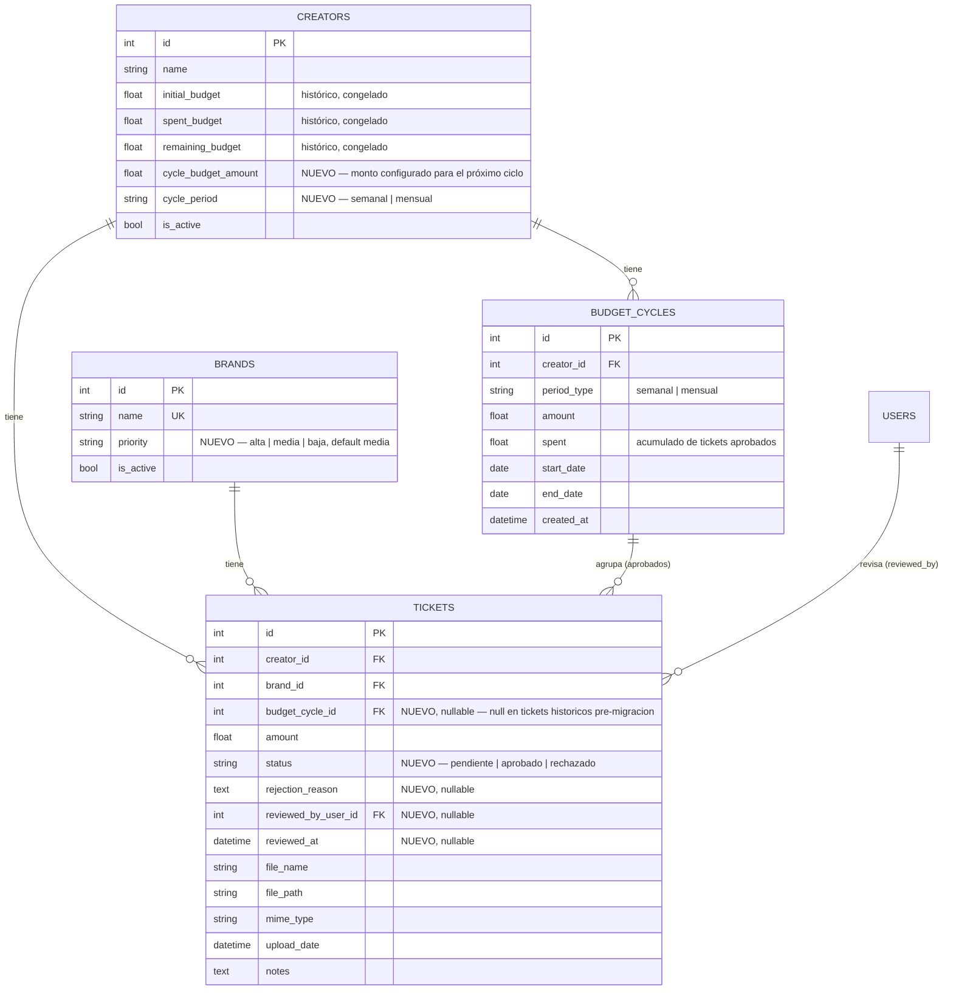

# Fase 1 — Diseño del paquete de mejoras integrales v2

> Entregable de Fase 1 según `doc/prompt-mejoras-integrales.md`. Cubre los 11 bloques (R1-R11). Me detengo aquí — no se escribe código de features hasta aprobar esto, en particular las reglas de negocio de R7 (ciclos) y R10 (validación).

---

## 0. Supuestos y decisiones a confirmar

El prompt marca varias decisiones como "ya tomadas" a nivel de forma (ciclos con renovación sin rollover, prioridad de 3 niveles, PDF visual con gráficas, validación solo para tickets de creador) pero dejó explícitamente abiertas las reglas finas de R7/R10. Propongo una respuesta para cada una — son las que más impactan el modelo de datos, así que pido confirmación explícita antes de tocar código (ver preguntas al final de mi mensaje, no solo aquí).

| # | Pregunta abierta | Mi propuesta | Por qué |
|---|---|---|---|
| A | ¿A qué ciclo se carga un ticket aprobado a destiempo: fecha del ticket o fecha de aprobación? | **Fecha del ticket** (su `upload_date`, fijada al crearlo) | Un gasto de marzo debe contar en el ciclo de marzo aunque se apruebe en abril — si no, el histórico por periodo queda incoherente con la fecha real del gasto |
| B | ¿Puede un ciclo cerrar en negativo? | **✅ DECIDIDO POR EL USUARIO: Sí, se permite.** Aprobar (o auto-aprobar) **siempre** deduce del ciclo de destino, sin importar si lo deja en negativo — el admin conserva control total, sin bloqueos automáticos | El usuario prefirió no bloquear correcciones/urgencias; el sistema debe **mostrar** el negativo con claridad (mismo tratamiento visual que ya existe para `remaining_budget <= 0`), no impedirlo |
| C | ¿Qué pasa con un ticket pendiente si su ciclo ya no tiene fondos al revisarlo? | **✅ DECIDIDO POR EL USUARIO: el admin puede aprobarlo igual**, dejando el ciclo en negativo — coherente con la decisión B | Ídem — control total del admin, con visibilidad clara del sobregiro en vez de un bloqueo duro |
| D | Cambiar monto/periodicidad de un creador ¿aplica al ciclo vigente o solo a futuros? | **Solo a ciclos futuros** — el ciclo en curso conserva su monto original hasta que termina | Recalcular un ciclo a medias es sorpresivo (¿qué pasa con lo ya gastado contra el monto viejo?) y abre la puerta a "inflar" el presupuesto a último momento para evitar que rechacen un ticket |
| E | Migración de los ~350 tickets históricos + presupuesto acumulado actual | **Congelar como histórico** — `Creator.initial_budget/spent_budget/remaining_budget` dejan de recibir escrituras nuevas (quedan como snapshot informativo "histórico acumulado"); los ciclos (`BudgetCycle`) arrancan de cero desde la migración, con periodicidad mensual y monto sugerido = `initial_budget/12` (editable de inmediato por el admin) | Reconstruir 12 ciclos mensuales retroactivos por creador implicaría inventar un monto mensual que nunca existió como tal (el presupuesto siempre fue un solo monto anual) — es menos honesto que admitir que el histórico es pre-ciclos y arrancar limpio |

Te pregunto estas 5 explícitamente al final (con opciones) porque son las que más determinan el esquema. El resto del documento asume estas respuestas; si cambias alguna, ajusto antes de programar.

**Otros supuestos menores** (los marco pero no los elevo a pregunta, corrígeme si alguno está mal):
- Semana = lunes a domingo. Mes = calendario (1 al último día).
- El botón "Nuevo Ticket" para un `creador` sigue existiendo (sube su propio ticket, nace pendiente); para `admin`/`superadmin` sigue auto-aprobando como hoy.
- La cuenta `admin` deja de ver "Usuarios" pero conserva "Validación" (bandeja de tickets pendientes) — no estaba en la lista de accesos de R5 explícitamente pero se infiere de "ve y opera todo lo demás... validación de tickets".
- El PDF se genera en el **frontend** (no backend) — ver §7.
- El visor multimedia (R11) no necesita librería nueva — ver §7.

---

## 1. Modelo de datos



### Reglas de asignación y cálculo (implementación perezosa, sin cron)

`crud.get_or_create_cycle_for_date(db, creator, target_date) -> BudgetCycle`:
1. Busca un `BudgetCycle` de ese creador cuyo rango `[start_date, end_date]` contenga `target_date`. Si existe, lo devuelve.
2. Si no existe, toma el último ciclo del creador (`end_date` más reciente) y crea ciclos **consecutivos** (cada uno inicia el día siguiente al `end_date` del anterior, usando SIEMPRE la config actual del creador — `cycle_period`/`cycle_budget_amount`) hasta que uno contenga `target_date`. Si el creador no tiene ningún ciclo todavía, el primero arranca en el límite natural del periodo que contiene `target_date` (lunes de esa semana, o día 1 de ese mes) — así un presupuesto "mensual" siempre corresponde a un mes calendario completo, no a "un mes desde que se configuró".
3. Idempotente: se puede llamar en cada request sin duplicar ciclos.

Se invoca: (a) al crear un ticket, con `target_date = upload_date` (normalmente "hoy"); (b) al mostrar el estatus del ciclo vigente (dashboard, `CreatorList`, `/perfil` de un creador), con `target_date = hoy`.

### Aprobación / rechazo (`POST /api/tickets/{id}/aprobar` | `/rechazar`)

- **Aprobar**: `cycle.spent += amount` **incondicionalmente** — nunca rechaza por fondos insuficientes (decisión B/C del usuario). `ticket.status = "aprobado"`, `reviewed_by/reviewed_at`, `audit_log` (queda registrado si el ciclo terminó en negativo, vía `details` del log). Todo en una transacción.
- El frontend sí **advierte** antes de confirmar si `ticket.amount > cycle.remaining` ("Esto dejará el ciclo en $X negativo") — es una advertencia informativa, el botón "Aprobar" sigue habilitado; el admin decide.
- **Rechazar**: requiere `reason` (texto no vacío) en el body. `ticket.status = "rechazado"`, guarda motivo + revisor + fecha, `audit_log`. Sin impacto en presupuesto.
- Tickets de `admin`/`superadmin`: se crean ya `status="aprobado"` (mismo request de creación, como hoy) — su `budget_cycle_id` se asigna igual (por fecha del ticket) y se descuenta de inmediato del ciclo correspondiente, **sin bloqueo** si lo deja en negativo (mismo criterio, `UploadTicketModal` ya solo advertía sin bloquear — ahora backend y frontend quedan consistentes).
- Tickets de `creador`: se crean `status="pendiente"`, se les asigna `budget_cycle_id` (regla A) pero no descuentan presupuesto en ese momento — solo al aprobar.
- En toda vista donde se muestre el estatus de un ciclo (dashboard, `CreatorList`, `/perfil`, bandeja de Validación), un `remaining` negativo se muestra en rojo con el monto exacto (mismo tratamiento que ya existe hoy para `remaining_budget <= 0`).

### Migración (idempotente, script nuevo `backend/migrate_ciclos_y_validacion.py`)

1. Agrega columnas nuevas (SQLAlchemy `create_all` ya cubre tablas nuevas; para columnas nuevas en tablas existentes uso `ALTER TABLE` directo vía SQLite, con chequeo de "si la columna ya existe, no la vuelvas a agregar" para poder correrlo más de una vez sin error).
2. `UPDATE tickets SET status = 'aprobado' WHERE status IS NULL` (deja `budget_cycle_id` en `NULL` — son pre-ciclos).
3. Por cada `Creator` activo sin `cycle_budget_amount` configurado: `cycle_period = 'mensual'`, `cycle_budget_amount = round(initial_budget / 12, 2)`.
4. No toca `initial_budget`/`spent_budget`/`remaining_budget` — quedan como están (histórico).
5. Actualiza `seed.py` (agrega `cycle_budget_amount`/`cycle_period` al crear creadores) y `seed_demo_year.py` (sus tickets simulados quedan `status='aprobado'`, `budget_cycle_id=NULL` — siguen siendo "histórico pre-ciclos"; no se les inventan ciclos retroactivos, consistente con la decisión E).

---

## 2. Matriz de permisos actualizada

Cambios respecto a `doc/auth-arquitectura.md` (marco **NUEVO** o **CAMBIO**):

| Método | Endpoint | Anon | Creador | Admin | Superadmin | Nota |
|---|---|---|---|---|---|---|
| * | `/api/users/*` (todos) | ❌ | ❌ | **❌ (CAMBIO, antes veía `creador`)** | ✅ | R4 |
| GET | `/api/tickets/?status=` | ❌ | ✅ (forzado a lo propio) | ✅ | ✅ | **NUEVO** filtro |
| POST | `/api/tickets/{id}/aprobar` | ❌ | ❌ | ✅ | ✅ | **NUEVO** |
| POST | `/api/tickets/{id}/rechazar` | ❌ | ❌ | ✅ | ✅ | **NUEVO** |
| GET | `/api/creators/{id}/ciclo-actual` | ❌ | ✅ solo propio | ✅ | ✅ | **NUEVO** |
| GET | `/api/creators/{id}/ciclos` (histórico) | ❌ | ✅ solo propio | ✅ | ✅ | **NUEVO** |
| PUT | `/api/creators/{id}/presupuesto` (monto/periodicidad) | ❌ | ❌ | ✅ | ✅ | **NUEVO** |
| PUT | `/api/brands/{id}` (incluye `priority` ahora) | ❌ | ❌ | ✅ | ✅ | sin cambio de rol, solo campo nuevo |
| POST | `/api/tickets/` | ❌ | ✅ solo para sí mismo, **nace `pendiente`** | ✅ **auto-aprueba** | ✅ **auto-aprueba** | CAMBIO de comportamiento, no de rol |

Todo lo demás de la matriz original (`auth-diseno-fase1.md` §2) se mantiene sin cambios. Las pruebas de `test_users_management.py` que asumían que `admin` gestiona creadores se reescriben para esperar 403.

---

## 3. Arquitectura de temas (R2)

Variables semánticas nuevas (mapeadas desde las actuales, que se mantienen para no romper nada de golpe — se migran componente por componente en la Fase 2, bloque R2):

| Variable semántica nueva | Valor oscuro (default) | Valor claro |
|---|---|---|
| `--go-bg` | `--go-dark-900` (`#09090b`) | `#FFFFFF` |
| `--go-surface` | `--go-dark-800` (`#111113`) | `#FFFFFF` |
| `--go-surface-raised` | `--go-dark-700` (`#18181b`) | `#ECEBE0` |
| `--go-surface-sunken` | `--go-dark-600` (`#27272a`) | `#ECEBE0` con `filter: brightness(0.97)` o un tono intermedio propio |
| `--go-border` | `--go-dark-600` | `#C5C5C5` |
| `--go-text-primary` | `#FFFFFF` | `#262626` |
| `--go-text-secondary` | `--go-gray-2` (`#C5C5C5`) | `#535353` |
| `--go-orange` / hover / pressed / tint | igual en ambos temas (marca) | igual |

Mecanismo: `data-theme="dark"|"light"` en `<html>`, con `:root[data-theme="light"] { ... }` sobreescribiendo. Script inline en `index.html` (antes de cualquier CSS/JS de la app) lee `localStorage.getItem("theme")` y aplica el atributo antes del primer paint — evita el flash. Default `dark` si no hay preferencia guardada (no seguimos `prefers-color-scheme` del SO, ya que el default explícito pedido es oscuro).

Todos los `style={{ background: "var(--go-dark-800)" }}` inline existentes se migran a las variables semánticas de arriba (ej. `var(--go-surface)`), auditando archivo por archivo en el bloque R2 de Fase 2 — son ~15 componentes.

`apexTheme.js`: `createApexOptions` recibe un parámetro `theme` ('dark'|'light') y selecciona `foreColor`/`borderColor`/`tooltip.theme` según corresponda; cada chart se re-renderiza al cambiar tema porque `theme` pasa a ser una prop derivada del contexto de tema (React re-ejecuta el render, ApexCharts recibe nuevas `options`).

Contraste AA: texto sobre naranja (`--go-orange` `#FB670B`) usa blanco en ambos temas (ya es así) — verificado con calculadora de contraste, blanco sobre `#FB670B` da ~2.9:1 en texto normal (insuficiente para AA en texto pequeño) pero los usos actuales son botones con texto **bold** ≥14px, que caen en el umbral de "texto grande" de WCAG (AA requiere 3:1) — pasa. Badges usan fondo tintado + texto de color saturado sobre superficie oscura/clara, se revisan caso por caso en R2.

## 4. Patrón responsive (R3)

- **Header + sidebar**: `<768px` el sidebar se oculta y aparece como drawer overlay (fixed, desliza desde la izquierda, backdrop oscuro, cierra con backdrop/Escape/al navegar); el header muestra un botón hamburguesa que lo abre. `≥768px`: comportamiento actual (colapsado/expandido persistido).
- **Tablas**: TODAS (Transacciones, Creadores/Marcas/Usuarios en Administración) usan el mismo patrón por consistencia: `<640px` se renderizan como lista de tarjetas (una `.go-card` por fila, con los mismos datos apilados); `≥640px` tabla normal.
- **Modales/formularios**: grids de 2 columnas (ej. formulario de creador) pasan a 1 columna `<640px`; el popover de perfil se ancla a la derecha del header con `max-width` para no desbordar en 375px.
- **Dashboard**: altura de gráficas se reduce en móvil (`height` responsive vía prop), leyendas pasan a `position: "bottom"` en vez de al lado.
- Criterio de aceptación (375×667, sin scroll horizontal de página) se verifica con Playwright en Fase 3 (`page.setViewportSize`).

## 5. Wireframes (ASCII)

**Header + popover de perfil**
```
┌──────────────────────────────────────────────────────────────┐
│ [GO] Grupo Ortiz                      [🌙/☀️]  [ML ▾]         │
└──────────────────────────────────────────────────────────────┘
                                          al click en [ML ▾]:
                                          ┌────────────────────┐
                                          │ Mariana López      │
                                          │ Creador            │
                                          ├────────────────────┤
                                          │ Mi perfil          │
                                          │ Cerrar sesión      │
                                          └────────────────────┘
```

**Validación (admin/superadmin)**
```
┌ Validación de Tickets ──────────────────────── 3 pendientes ─┐
│ ┌────────────┬──────────┬─────────┬──────────┬─────────────┐│
│ │ Creador    │ Marca    │ Monto   │ Fecha     │ Acciones    ││
│ ├────────────┼──────────┼─────────┼──────────┼─────────────┤│
│ │ Mariana L. │ Nike     │ $1,200  │ 14 jul    │[Ver][✓][✗] ││
│ └────────────┴──────────┴─────────┴──────────┴─────────────┘│
│  [Ver] abre visor (imagen/PDF embebido) + detalle            │
│  [✗] pide motivo obligatorio antes de confirmar               │
└────────────────────────────────────────────────────────────────┘
```

**Gestión de presupuesto por creador** (dentro de Administración → Creadores, o tarjeta en `CreatorList`)
```
┌ Mariana López ───────────────────────────────────────────────┐
│ Ciclo vigente: 1-31 jul 2026 (12 días restantes)              │
│ [████████████░░░░░] 68% usado — $10,200 de $15,000            │
│ Configurar: monto [15000] periodicidad [Mensual ▾] [Guardar]  │
│ [Ver histórico de ciclos]                                     │
└────────────────────────────────────────────────────────────────┘
```

**Visor multimedia** (modal, mismo para Transacciones/Validación/vista creador)
```
┌ Comprobante — ticket #142 ───────────────────────────── [x] ─┐
│                                                                │
│              (imagen con zoom o <iframe> de PDF)              │
│                                                                │
└────────────────────────────────────────────────────────────────┘
```

**Selector de PDF** (modal simple al click en "Descargar PDF")
```
┌ Descargar reporte ────────────────────────────────────── [x]─┐
│ ( ) Mes actual (julio 2026)                                   │
│ ( ) Meses específicos:  [Jun ▾] [Jul ▾] [+ agregar]           │
│                                          [Cancelar] [Generar] │
└────────────────────────────────────────────────────────────────┘
```

## 6. Responsividad + temas: orden de auditoría por archivo

Componentes con `style={{ ...var(--go-dark-*) }}` inline a migrar en R2 (conteo aproximado por grep): `Sidebar`, `Dashboard`, `CreatorList`, `TransactionTable`, `AdminView`, `UserManagement`, `Modal`, `UploadTicketModal`, `LoginPage`, `ProfilePage`, `ForbiddenPage`, `HomePage`, `KpiCard`, `DateRangeFilter`, los 4 archivos de `charts/`. Se listan explícitamente en el plan de commits de Fase 2 (§8) para no perder ninguno.

## 7. Estrategia de PDF (R8) y dependencias nuevas

**Decisión: generación en el frontend** con `jspdf` + `html2canvas`, cargadas con `import()` dinámico (solo cuando se hace click en "Descargar PDF" — no engordan el bundle principal).

| Opción | Pros | Contras |
|---|---|---|
| Frontend (jsPDF + html2canvas) | WYSIWYG exacto con las gráficas ya renderizadas (no hay que reimplementarlas); cero dependencias nuevas en backend (evita librerías con dependencias nativas problemáticas en Windows, ej. WeasyPrint/Cairo) | Texto y gráficas quedan rasterizados (no seleccionables); paginación manual |
| Backend (reportlab / weasyprint) | Texto vectorial nítido | Reimplementar cada gráfica desde cero server-side, o instalar dependencias nativas de compilación pesada en Windows — alto costo para un reporte interno no legal |

Para el usuario interno (no es un documento legal que requiera texto seleccionable), el trade-off de frontend es claramente mejor dado el filtro de "dependencias mínimas y justificadas" del proyecto.

**Mecánica**: un contenedor oculto fuera de pantalla renderiza una plantilla de impresión dedicada (KPIs + las 4 gráficas existentes + tablas de desglose por marca —con prioridad— y por creador, logo GO, fecha de generación) **forzando tema claro** (envuelve el contenedor con `data-theme="light"` local, sin afectar el tema del usuario) para que imprima bien. Se captura con `html2canvas` sección por sección y se ensamblan como páginas en `jsPDF`.

**Dependencias nuevas exactas**: `jspdf` (~“MIT”, generación de PDF) y `html2canvas` (MIT, captura de DOM a canvas). Ninguna dependencia nueva en backend.

## 8. Plan de commits (Fase 2, mismo orden que el prompt)

1. `feat: gestión de usuarios exclusiva de superadmin` (R4) — backend + frontend + pruebas.
2. `feat: modelo de ciclos de presupuesto + migración + gestión` (R7) — modelos, crud, endpoints, migración, `CreatorList`/`UploadTicketModal`/`ProfilePage` leyendo el ciclo vigente, KPIs del dashboard recalculados sobre ciclo vigente agregado.
3. `feat: estados de ticket y flujo de validación` (R10) — modelo, endpoints aprobar/rechazar, bandeja de Validación, indicador de pendientes, auditoría, vista del creador con estado/motivo.
4. `feat: prioridad de marcas` (R9) — columna, CRUD, badges, orden, filtros, integración con PDF.
5. `feat: visor de archivos multimedia in-app` (R11) — modal reutilizable, integrado en Transacciones/Validación/vista creador.
6. `feat: header global con popover de perfil` (R1) — reorganización de Sidebar.
7. `feat: sistema de temas claro/oscuro` (R2) — variables semánticas, toggle, charts theme-aware.
8. `feat: responsividad completa (drawer móvil, tablas a tarjetas)` (R3).
9. `feat: reporte PDF del dashboard` (R8).

Después de cada commit: pytest en verde + reinicio en frío del backend si hubo cambios ahí + smoke visual.

---

## Preguntas para aprobar antes de programar

Ver preguntas estructuradas a continuación de este mensaje (decisiones A-E de la tabla de §0). Todo lo demás de este documento queda sujeto a tu aprobación general.
