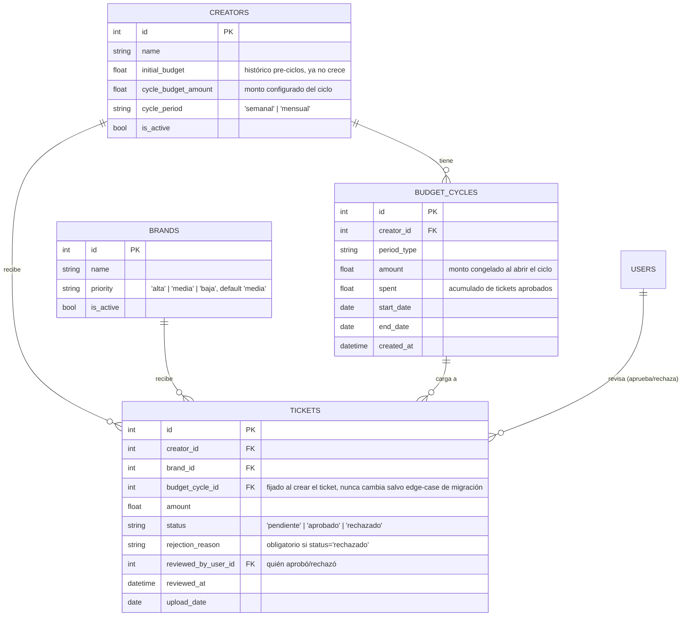

# Ciclos de presupuesto, validación de tickets y prioridad de marcas

> Diseño final implementado (paquete R1-R11 de `doc/prompt-mejoras-integrales.md`). Reglas de negocio confirmadas explícitamente por el usuario en Fase 1 (`doc/mejoras-diseno-fase1.md` §0); este documento es la referencia definitiva de cómo se comportan en código, con ejemplos.

---

## 1. Modelo de datos

Código: `backend/app/models.py` (`BudgetCycle`, `CyclePeriod`, `TicketStatus`, `BrandPriority`), `backend/app/crud.py`, `backend/app/routers/{creators,brands,tickets}.py`.

## 2. Ciclos de presupuesto (R7)

### 2.1 Configuración

El admin/superadmin configura por creador: `cycle_budget_amount` (monto) + `cycle_period` (`semanal` o `mensual`) al crear o editar un `Creator`. **Cambiar estos valores solo afecta a los ciclos FUTUROS** — el ciclo en curso conserva el monto con el que abrió. Ver `crud.create_creator`/`update_creator`: nunca tocan un `BudgetCycle` ya existente.

> Ejemplo: un creador tiene un ciclo mensual de $10,000 vigente (del 1 al 31 de julio), ya gastó $6,000. El admin le sube el monto a $15,000 el día 20 de julio. El ciclo de julio sigue con $10,000 de tope (restante $4,000); el ciclo de agosto abrirá con $15,000.

### 2.2 Apertura perezosa (sin cron)

No existe un job programado que abra ciclos. `crud.get_or_create_cycle_for_date(db, creator, fecha)` se llama:
- Al crear un ticket (con `fecha = hoy`).
- Al consultar `GET /api/creators/{id}/ciclos` (histórico) o cualquier endpoint que necesite el ciclo vigente de un creador.

Si no existe un ciclo que cubra esa fecha, se crea uno nuevo con los límites naturales del calendario:
- **Semanal**: lunes a domingo (`_week_bounds`).
- **Mensual**: día 1 al último día del mes calendario (`_month_bounds`, calcula bisiestos correctamente).

### 2.3 Relleno de huecos ("gap-filling")

Si nadie usó la app por varios periodos, el próximo `get_or_create_cycle_for_date` **materializa también los ciclos intermedios** que faltan (uno por uno, encadenados desde el último ciclo existente hasta cubrir la fecha pedida), todos con el monto y periodicidad **actuales** del creador en ese momento. Esto evita huecos en el histórico y evita tener que reconstruir manualmente qué pasó en meses sin actividad.

> Ejemplo: un creador mensual no tiene ciclos desde julio. En octubre se le aprueba un ticket → se crean automáticamente los ciclos de julio, agosto, septiembre y octubre (los tres primeros con spent=0, el de octubre recibe el ticket).

### 2.4 Asignación de un ticket a su ciclo — por fecha de subida, NO por fecha de aprobación

**Decisión confirmada por el usuario** (Fase 1, pregunta A): un ticket se asigna al ciclo vigente el día en que se **sube** (`upload_date` = hoy), sin importar cuándo se apruebe después. Esto se fija una sola vez en `crud.create_ticket` (`budget_cycle_id = get_or_create_cycle_for_date(db, creator, date.today())`) y **`crud.approve_ticket` nunca lo recalcula** — solo usa `ticket.budget_cycle` ya asignado.

> Ejemplo (verificado en `test_late_approval_charges_original_cycle_not_current`): un creador sube un ticket el 16 de julio (ciclo de julio, mensual). El admin lo revisa hasta el 5 de agosto, cuando el ciclo de agosto ya está vigente. Al aprobarlo, el monto se descuenta del ciclo de **julio** (el original), no del de agosto — el ciclo de agosto queda intacto.

Esto también resuelve implícitamente la pregunta "¿qué pasa con un ticket pendiente cuando cierra su ciclo?": nada — sigue enganchado a ese ciclo para siempre, listo para descontar de ahí en cuanto se valide, sin importar cuánto tiempo pase.

### 2.5 Presupuesto negativo — SIEMPRE permitido, nunca bloquea

**Decisión confirmada por el usuario, revirtiendo la recomendación inicial del diseño** (Fase 1, pregunta B): aprobar o auto-aprobar un ticket **jamás** se bloquea por falta de fondos, sin importar cuánto exceda el restante del ciclo. El admin tiene control total y puede decidir aprobar aun sabiendo que deja el ciclo en negativo.

- `crud.create_ticket` y `crud.approve_ticket` **no validan fondos** — solo hacen `cycle.spent += amount`.
- La UI (`ValidationQueue.jsx`, `UploadTicketModal.jsx`) muestra una advertencia visual (ámbar) cuando el monto excede el restante, pero **nunca deshabilita** el botón de aprobar/registrar.
- Verificado en `test_approve_can_push_cycle_negative` y `test_approve_pushes_cycle_negative_without_blocking`.

> Ejemplo: un creador tiene $100 restantes en su ciclo. Sube un ticket de $500. El admin lo aprueba de todas formas (viendo la advertencia); el ciclo queda en $100 - $500 = **-$400**. La app lo muestra en rojo, pero no impide nada.

### 2.6 Migración de datos históricos

`backend/migrate_ciclos_y_validacion.py` (idempotente, corre desde `backend/`):
- **No reconstruye ciclos retroactivos** para los ~355 tickets que ya existían — se decidió congelar ese histórico como "pre-ciclos" en vez de inventar límites de ciclo que nunca existieron. Todos esos tickets se marcan `status='aprobado'` (ya estaban aprobados de facto, antes de que existiera el concepto de validación).
- A cada creador sin `cycle_budget_amount` configurado se le asigna `cycle_period='mensual'` y `cycle_budget_amount = initial_budget / 12` (una aproximación razonable de "presupuesto anual repartido en 12 meses"), como punto de partida editable por el admin.
- Los ciclos empiezan a existir de verdad (con `start_date`/`end_date` reales) recién desde el primer uso posterior a la migración — apertura perezosa, como siempre.

## 3. Validación de tickets (R10)

### 3.1 Estados

`pendiente → aprobado | rechazado` — ambos terminales, no hay transición de vuelta ni de uno a otro directamente (un ticket rechazado no se puede luego aprobar; el creador debe volver a subirlo como un ticket nuevo).

### 3.2 Quién necesita validación

- Un ticket subido por un usuario `admin` o `superadmin` **se auto-aprueba y descuenta de inmediato** (mismo comportamiento que antes de este paquete) — `crud.create_ticket` decide el `status` inicial según el rol del actor (`routers/tickets.py::create_ticket`).
- Un ticket subido por un usuario `creador` **siempre nace `pendiente`** y **no descuenta nada** hasta que un admin/superadmin lo apruebe.

### 3.3 Bandeja de validación

Ruta `/validacion` (solo `admin`/`superadmin`, componente `ValidationQueue.jsx`): lista los tickets `pendiente` con creador, marca (+ badge de prioridad, R9), monto, fecha, restante del ciclo, y tres acciones:
- **Ver**: abre el comprobante en el visor in-app (R11, ver §5) sin descargarlo.
- **Aprobar**: descuenta del ciclo asignado al ticket (§2.4), sin validar fondos (§2.5). Registra `reviewed_by_user_id` + `reviewed_at`.
- **Rechazar**: exige un motivo (`rejection_reason`, obligatorio, no vacío) — nunca descuenta. El creador lo ve en su vista de Transacciones (tooltip sobre el badge "Rechazado").

Un badge con el conteo de pendientes aparece junto a "Validación" en la barra lateral y se actualiza al cargar la app o al aprobar/rechazar (`App.jsx`, `pendingCount`).

### 3.4 Auditoría

Todo ticket aprobado o rechazado guarda quién lo hizo (`reviewed_by_user_id`) y cuándo (`reviewed_at`), visible en la respuesta de la API (`TicketResponse`) aunque todavía no hay una vista de auditoría dedicada en el frontend.

## 4. Prioridad de marcas (R9)

- Campo `priority` en `Brand`: `alta` | `media` | `baja`, default `media`. Validado en el backend (`routers/brands.py::_validate_priority`, 400 si el valor no es uno de los tres).
- **Orden**: en cualquier listado de marcas (selectores, tabla de Administración, desglose del dashboard), alta aparece antes que media antes que baja (`crud._priority_rank`, un `CASE` SQL — el orden alfabético no sirve porque "alta" < "baja" < "media" alfabéticamente).
- **Badges**: alta = rojo (`go-badge-error`), media = ámbar (`go-badge-warning`), baja = verde (`go-badge-success`) — ver `frontend/src/utils/priority.js`.
- **Filtro**: en Transacciones y en la bandeja de Validación, el filtro por prioridad es **client-side** (el campo ya viaja en la respuesta de tickets/desglose, no hay un query param de backend dedicado — no hace falta, el volumen de datos no lo justifica).
- Se incluye en el reporte PDF (§6 de `mejoras-diseno-fase1.md`): la tabla de desglose por marca muestra la prioridad de cada una.

## 5. Visor de archivos multimedia (R11)

`MediaViewerModal.jsx`: imágenes con zoom básico (100%-250%) o PDF embebido en `<iframe>`, siempre apuntando al endpoint autenticado `GET /api/tickets/file/{id}` (nunca una URL pública) — las cookies de sesión viajan automáticamente por ser mismo origen. Reutilizado en Transacciones, Validación y la vista del creador. Un archivo faltante muestra un mensaje claro en vez de un ícono roto.

## 6. Reporte PDF (R8)

Generado 100% en el frontend (`jspdf` + `html2canvas`, cargadas con `import()` dinámico solo al hacer click en "Descargar PDF", cero dependencias nuevas en backend). Una plantilla off-screen (`DashboardPdfTemplate.jsx`) fuerza tema claro localmente (`data-theme="light"` en un contenedor propio — ver la nota sobre este selector en `CLAUDE.md`) y se captura sección por sección para armar las páginas del PDF con paginación natural (nunca corta una gráfica a la mitad). El período del reporte es el mismo que el filtro de fechas ya seleccionado en el Dashboard (que ya incluye presets como "Este mes"/"Meses específicos"), evitando un selector duplicado.

## 7. Pruebas que cubren estas reglas

- `backend/tests/test_budget_cycles.py`: límites de semana/mes (incluye bisiestos), idempotencia, apertura de ciclo siguiente, relleno de huecos, que cambiar la config no toca el ciclo vigente, **asignación por fecha de subida cruzando un cambio de ciclo**, **aprobar puede dejar el ciclo en negativo**, listado de histórico.
- `backend/tests/test_ticket_validation.py`: ticket de creador nace pendiente y no descuenta, ticket de admin se auto-aprueba y descuenta, aprobar/rechazar un pendiente, rechazo exige motivo, el creador ve el motivo, no se puede volver a aprobar un ticket ya aprobado, un creador no puede aprobar/rechazar (403), filtro por estado, aprobar empuja el ciclo a negativo sin bloquear.
- `backend/tests/test_brand_priority.py`: default `media`, valores válidos/inválidos al crear y editar, orden alta/media/baja, el desglose de gastos por marca incluye prioridad y solo cuenta tickets aprobados.
- `frontend/e2e/presupuesto-flujo-completo.spec.js`: el flujo de punta a punta — creador sube pendiente → admin rechaza con motivo → creador ve el motivo y re-sube → admin aprueba y descuenta del ciclo vigente — más tema, popover, PDF y el recorrido en 375px.
